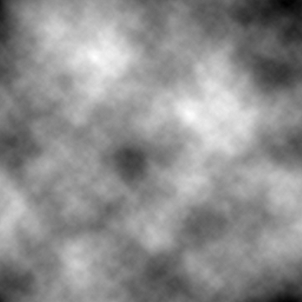
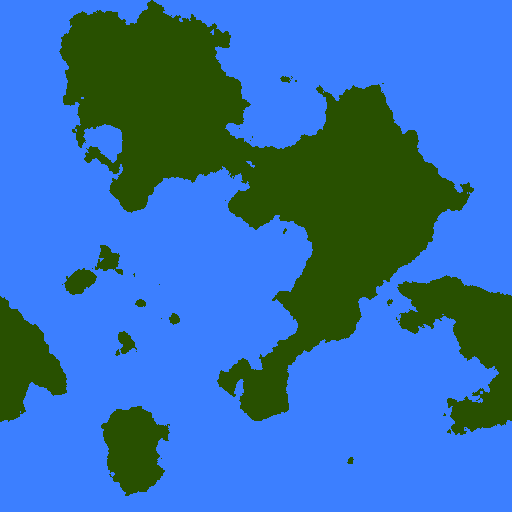
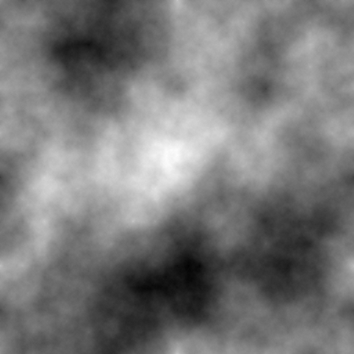
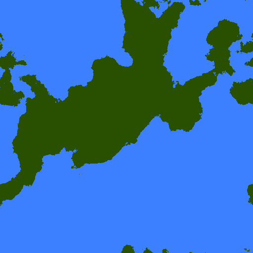

  
Table of Contents

  <ol>
    <li><a href="#about-the-project">About the project</a></li>
    <li><a href="#examples">Examples</a></li>
    <li><a href="#installation">Installation</a></li>
    <li><a href="#how-to-use">How to use</a></li>
    <li><a href="#contact">Contact</a></li>
  </ol>

## About the project

Map-generator is a tool for generating two-dimensional noise and maps.

Built with:

- Typescript
- React

## Examples

Perlin noise:

Perlin noise map:

Diamond square algorithm noise:

Diamond square algorithm noise map:

## Installation

TBD

## How to use

1. Choose a variant from select field.
2. Use settings to customize the result.

## Contact

Email: - kamil.poncyliusz@gmail.com

Github repo: [github.com/kamil-poncyliusz/map-generator](https://github.com/kamil-poncyliusz/map-generator)
